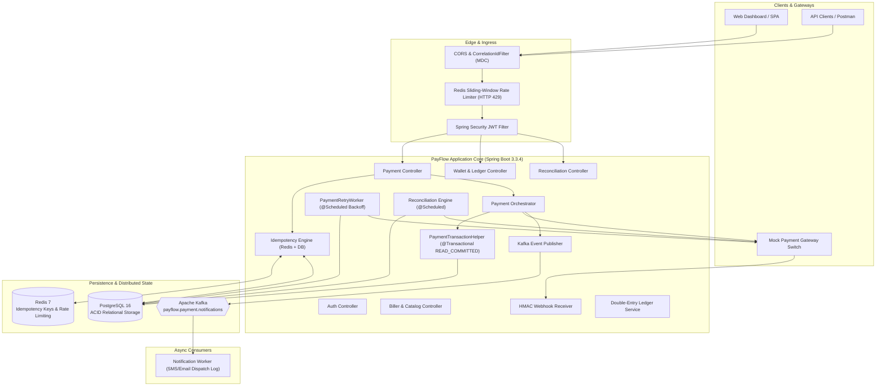
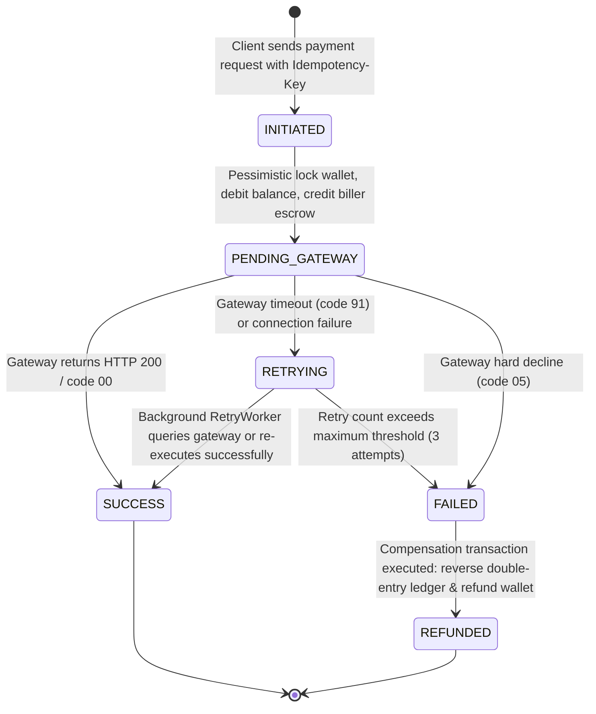
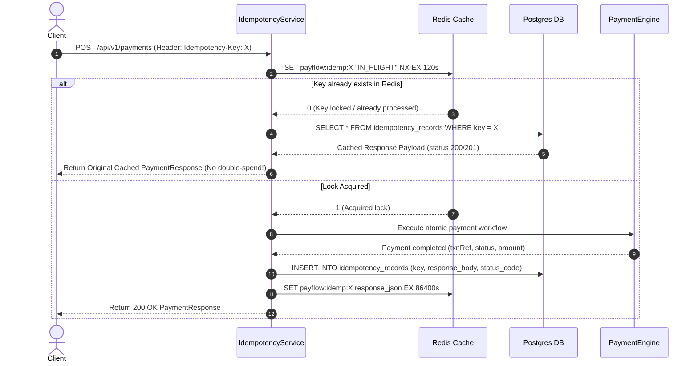
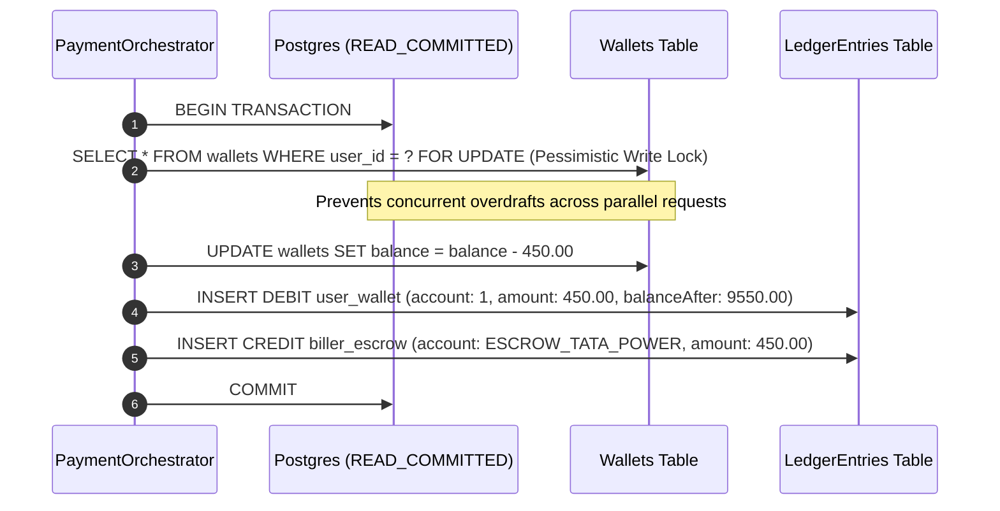

# ⚡ PayFlow — Enterprise Bill Payment & Recharge Platform

[](https://github.com/payflow/payflow-backend/actions)
[](https://openjdk.org/)
[](https://spring.io/projects/spring-boot)
[](https://www.postgresql.org/)
[](https://redis.io/)
[](https://kafka.apache.org/)
[](https://www.docker.com/)
[](LICENSE)

**PayFlow** is an enterprise-grade, backend-heavy Bill Payment & Recharge Platform engineered to mirror the mission-critical architecture of real-world fintech payment switches (e.g., Bharat BillPay / Stripe / Razorpay). It implements rigorous production patterns including **distributed idempotency keys**, **atomic double-entry accounting ledgers**, **pessimistic concurrency row-locking**, **fault-tolerant exponential backoff retries**, **HMAC-SHA256 verified webhooks**, **sliding-window rate limiting**, and **Kafka-driven asynchronous event streaming**.

---

## 🏛️ System Architecture



---

## 🔄 Core Technical Flows

### 1. Payment Lifecycle & State Machine
Every payment transaction moves through a deterministic state machine:



### 2. Distributed Idempotency Key Engine
Prevents duplicate charges caused by client-side retries, network dropouts, or double-clicks:



### 3. Double-Entry Accounting Ledger (Zero-Sum Invariant)
Every financial transaction requires two balanced entries ensuring:
$$\sum \text{Debits} == \sum \text{Credits}$$



---

## 💡 Production Architecture Deep Dives

### 1. Idempotency Key Design Decisions
- **Two-Tier Storage**:
  - **Tier 1 (Redis `SETNX`)**: Provides sub-millisecond atomic mutual exclusion locks for concurrent in-flight requests. If a second thread submits the same key while the first is actively executing, the second thread is blocked or receives a conflict state.
  - **Tier 2 (PostgreSQL `idempotency_records`)**: Guarantees long-term durability (24+ hours) surviving Redis cache evictions or restarts.
- **Payload Hash Verification**:
  - Each idempotency record stores `request_hash = SHA256(userId + billerId + amount + consumerNumber)`.
  - If a client reuses an idempotency key with *different* payload parameters, the system rejects it with `HTTP 422 Unprocessable Entity` ("Idempotency key reused with different request payload").

### 2. Fault-Tolerant Retry Mechanism with Exponential Backoff
- **Separation of Gateway Call from DB Lock**:
  - To prevent database connection pool starvation, the database transaction that reserves wallet funds commits *before* entering external gateway HTTP I/O.
- **Exponential Backoff Formula**:
  $$\text{Backoff Interval} = \text{baseDelay} \times (\text{multiplier})^{\text{retryCount}} + \text{jitter}$$
  - Attempt 1: $+2\text{s}$
  - Attempt 2: $+8\text{s}$
  - Attempt 3: $+32\text{s}$
- **Gateway Reconciliation Before Re-execution**:
  - When the background `PaymentRetryWorker` picks up a `RETRYING` transaction, it first queries the gateway settlement registry (`inquireTransaction(txnRef)`). If the gateway already processed the transaction during the previous timeout window, the status is immediately marked `SUCCESS` without risking a double charge at the biller switch.
- **Automatic Refund on Exhaustion**:
  - If 3 retries fail, the transaction transitions to `FAILED`, triggering compensation logic: atomic wallet refund and balanced ledger entries (`CREDIT` user wallet, `DEBIT` biller escrow).

### 3. ACID Concurrency Control on Wallet Balances
- **Race Condition Hazard**: Two simultaneous payment requests for ₹600 from a wallet containing ₹1000 could both succeed if using standard `SELECT` followed by `UPDATE`.
- **Solution — Pessimistic Row Locking**:
  ```java
  @Lock(LockModeType.PESSIMISTIC_WRITE)
  @Query("SELECT w FROM Wallet w WHERE w.userId = :userId")
  Optional<Wallet> findByUserIdForUpdate(@Param("userId") Long userId);
  ```
  Generates `SELECT ... FOR UPDATE` in PostgreSQL, serializing concurrent updates at the database level with a zero-risk of overdraft.

---

## 🛠️ Tech Stack & Components

| Component | Technology | Rationale |
|:---|:---|:---|
| **Language** | Java 17 / 21 (Temurin) | Modern LTS Java with virtual thread readiness and strong typing |
| **Framework** | Spring Boot 3.3.4 | Industry-standard enterprise framework with robust ecosystem |
| **Database** | PostgreSQL 16 | Relational consistency, row-level locking, foreign keys, and indexes |
| **Cache / Idempotency** | Redis 7 | Atomic distributed locks (`SETNX`), TTL expiry, and sliding-window rate limiting |
| **Message Broker** | Apache Kafka (KRaft mode) | Durable, partitionable event streaming for decoupled notification workers |
| **Security** | Spring Security 6 + JWT | Stateless Bearer token authentication with role-based access control |
| **Documentation** | OpenAPI 3.0 / Swagger UI | Interactive API exploration and client generation (`/swagger-ui.html`) |
| **Observability** | Slf4j + Logback + MDC | Traceable `X-Correlation-ID` header propagating across all log lines |
| **Containerization** | Docker + Docker Compose | One-command reproducible local and staging environments |
| **CI / CD** | GitHub Actions | Automated build, lint, and test validation on JDK 17 & 21 |

---

## 🚀 Quick Start Guide

### Option A: Run Everything via Docker Compose (Recommended)
Prerequisites: Docker & Docker Compose installed.

```bash
# 1. Clone repository
git clone https://github.com/payflow/payflow.git
cd Payflow

# 2. Spin up App + PostgreSQL + Redis + Kafka
docker compose up --build -d

# 3. Check container status
docker compose ps
```

The services will be available at:
- **Web Dashboard**: `http://localhost:8080/`
- **Swagger OpenAPI Docs**: `http://localhost:8080/swagger-ui.html`
- **Actuator Health Check**: `http://localhost:8080/actuator/health`

### Option B: Run Standalone for Local Development
The application includes a `local` profile with zero external dependency requirements (uses in-memory H2 DB, in-memory concurrency locks, and embedded event dispatchers):

```bash
# 1. Build and run unit tests
mvn clean package

# 2. Run application
java -jar target/payflow-backend-1.0.0.jar
```

---

## 🧪 Testing & Verification

### Run Unit & Integration Tests (26 Tests)
```bash
mvn test
```
The test suite covers:
- `PaymentServiceTest`: Idempotency cache hits, timeout retries, decline refunds, rate limiting.
- `WalletServiceTest`: Concurrent top-ups, debiting, insufficient fund exceptions.
- `PaymentRetryWorkerTest`: Backoff scheduling, max retry exhaustion, automatic refunds.
- `ReconciliationServiceTest`: Discrepancy detection, gateway auto-resolution, audit logging.
- `RateLimiterServiceTest`: Sliding-window burst handling, HTTP 429 threshold enforcement.
- `MockPaymentGatewayServiceTest`: Deterministic testing triggers and settlement registry.
- `WebhookServiceTest`: HMAC-SHA256 signature verification and tamper detection.

### Run Automated End-to-End Verification Script
An end-to-end bash script is provided to test the live server:
```bash
./scripts/verify-e2e.sh
```
This validates:
1. JWT authentication (`POST /api/v1/auth/login`)
2. Initial wallet balance inquiry (`GET /api/v1/wallets/me`)
3. Primary bill payment with `Idempotency-Key` (`POST /api/v1/payments`)
4. Duplicate submission with identical key (confirms HTTP 200, identical response, and **no second wallet deduction**)
5. Simulated gateway timeout (`consumerNumber` ending in `999` $\rightarrow$ status `RETRYING`)
6. Simulated gateway decline (`consumerNumber` ending in `000` $\rightarrow$ status `FAILED` with atomic refund)
7. Audit double-entry ledger query (`GET /api/v1/wallets/ledger`)
8. Scheduled reconciliation job execution (`POST /api/v1/reconciliation/run`)

---

## 🎯 Mock Gateway Deterministic Testing Rules

When submitting bill payments, use these consumer number suffixes to test specific edge-cases:

| Consumer Number Suffix | Simulated Outcome | Expected System Behavior |
|:---|:---|:---|
| Ends in `...111` (e.g. `9876543111`) | **Instant SUCCESS** | Wallet debited, ledger committed, Kafka event dispatched |
| Ends in `...999` (e.g. `9876543999`) | **Gateway TIMEOUT (code 91)** | Status set to `RETRYING`, queued for background backoff retry |
| Ends in `...000` (e.g. `9876543000`) | **Hard DECLINE (code 05)** | Status set to `FAILED`, atomic wallet refund, compensation ledger entries |

---

## 🌟 Resume Highlights

Here is how you can describe this project on your resume:

- **Idempotent Payment Processing**: Engineered a two-tier idempotency system using Redis `SETNX` distributed locks and PostgreSQL durable records, guaranteeing zero double-charge transactions under high-frequency client retries and network partitions.
- **Fault-Tolerant Exponential Backoff**: Designed an asynchronous retry queue with exponential backoff and jitter ($2^n$ progression, max 3 attempts) for transient switch timeouts, incorporating automatic ACID-compliant wallet compensation upon exhaustion.
- **Event-Driven Architecture with Kafka**: Built an asynchronous event pipeline utilizing Apache Kafka for payment notification streaming, decoupling notification dispatch from latency-critical financial execution paths.
- **ACID Double-Entry Accounting Ledger**: Implemented a balanced double-entry ledger enforcing zero-sum financial invariant ($\sum \text{Debits} == \sum \text{Credits}$) with PostgreSQL row-level pessimistic locking (`SELECT ... FOR UPDATE`) to prevent concurrency race conditions.
- **Automated Financial Reconciliation**: Created a scheduled reconciliation engine that cross-checks unsettled internal payment states against external gateway settlement batches, auto-resolving drift and logging audit records.
- **Production Observability & Resilience**: Incorporated sliding-window rate limiting (HTTP 429), distributed MDC correlation ID tracing (`X-Correlation-ID`), HMAC-SHA256 webhook verification, and multi-stage Docker containerization with automated GitHub Actions CI.

---

## 📄 License
This project is licensed under the Apache 2.0 License.
